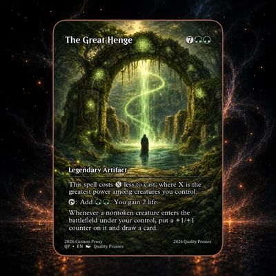

# Themes & Layouts — data-model + builder redesign

**Date:** 2026-08-01 · **Revised:** 2026-08-02 (feedback rounds 1-2) · **Status:** in review

## Context

The card system's single flat concept, `CardTemplate`, blends three things: world/feel
(palette, prompt flavor, shared parts), the card-data vocabulary (fields/defaults), and
presentation (Render, artAspect). The strain is visible: `kitId: 'arcane'` is a grouping
string with no backing entity, `arcane-hero-fullart` is a spread of `arcane-hero` with two
overrides, and the Image Lab lists *templates* as art styles when the style is really the
world's look.

This redesign introduces two first-class concepts, and reshapes the app around them:

- **Theme** — a collection/world (à la an MTG set or Pokémon series): identity, palette,
  SVG assets, raw building components, and a prose **look-and-feel prompt** that lets AI
  generate on-theme art and fill on-theme cards.
- **Layout** — how a card face organizes a set of components, **parameterized by
  arguments** (name, element, ability text, art, …). Many layouts per theme.

Alongside the model change, the app itself changes: the Code Lab is removed, the Builder
gains an AI fill flow, card-art generation becomes an explicit LLM-composed step driven by
the layout's arguments, and the Gallery becomes a true edit-roundtrip surface.

## Decisions

1. **Themes AND layouts are code-defined.** Both live as code modules (components are
   TSX; layouts are TSX compositions of theme parts). The theme's identity fields — `id`,
   `name`, `description`, `lookAndFeel` — are plain data on the theme object, validated by
   an effect Schema at registration. (No separate "manifest" wrapper — the look-and-feel
   prompt is simply part of the theme.) Fully data-defined/runtime-authorable themes are a
   future project.
2. **Clean break on saved data.** No migration, no compat decode. Old card sidecars fail
   the new row schema and are dropped by the existing lenient list decode. `cartis-data/cards`
   restarts from scratch.
3. **Layouts own their arguments.** A layout declares the argument spec it renders
   (`fields` + `defaults`, reusing the existing `FieldSpec` machinery). Layouts in the same
   theme share field definitions through ordinary code reuse (the theme module exports its
   common field list). Switching layouts preserves values for argument keys both layouts
   share; keys the new layout doesn't declare are simply not rendered or edited.
4. **Art is a function of the layout's arguments, composed by an LLM.** No more static
   per-template `artStylePrompt`. See "AI pipelines" below.
5. **The Code Lab AND the Image Lab are removed.** The app becomes two tabs: Builder and
   Gallery. The opencode agent infrastructure is *repurposed* (AI form fill, art-prompt
   composition), not deleted; the Gallery's existing Library tab becomes the image
   manager.
6. **AI fill is conversational.** Each card-editing episode gets a persistent opencode
   session, so refinement prompts ("make him angrier") build on the exchange — while every
   turn also carries a snapshot of the current field values, so hand edits between prompts
   are always respected.
7. **The AI may auto-generate art.** When a fill prompt implies art, generation fires as
   part of the fill (accepted cost: replicate calls are billed when live). The art slot's
   manual Generate action remains for direct control.
8. **Art is text-first; a source photo is optional steering.** The default path composes
   art purely from the layout's argument values + theme context. An attached photo
   (upload/camera) steers identity/pose when provided — the original stylize-my-face flow
   becomes the optional variant, not the center.
9. **Everything rendered persists to `cartis-data`.** Generated art → `images/`, exports
   → `exports/`, saved cards → `cards/` — no artifact lives only in memory. And every
   persisted artifact is re-openable: saved cards open back into the Builder for
   edit-and-resave (same record, same id).
10. **The fill agent is a capable, tool-using editor on a smart model.** Fill sessions run
    on a sonnet-class model (via `OPENCODE_MODEL`), make **targeted edits** (asked to
    change the title, it patches only the title), and are **vision-capable for art**: it
    can see the card's current art, understand a requested visual edit, and re-render by
    driving the image pipeline with the current art as the editing source.
11. **Card types are deliberately deferred.** If themes later need creature-vs-spell style
    variation, that becomes a grouping above layouts; not modeled now.

## Model (`src/cards/types.ts`)

`CardTemplate` is retired. `CardData`, `FieldValue`, `FieldSpec`, `FieldCondition`,
`CardRenderProps`, `CardRenderer` are unchanged.

```ts
interface Theme {
  // -- data-shaped identity, Schema-validated at registration --
  id: string;           // 'arcane'
  name: string;         // 'Arcane'
  description: string;  // world blurb (shown in pickers)
  lookAndFeel: string;  // prose visual identity, consumed by AI pipelines
  // -- code --
  CardBack: CardRenderer;         // shared back, promoted from ad-hoc export
  layouts: readonly Layout[];     // ordered; layouts[0] is the default
  /** Optional per-card flavor derived from data (e.g. essence artFlavor from the palette),
   *  appended to the LLM art-prompt context. */
  artFlavor?: (data: CardData) => string;
}

interface Layout {
  id: string;                     // unique within the theme: 'classic', 'fullart'
  name: string;
  description: string;
  fields: readonly FieldSpec[];   // the ARGUMENTS this layout takes
  defaults: CardData;             // seed values for a new card
  artAspect?: string;             // preferred replicate aspect for the art slot
  Render: CardRenderer;           // organizes theme components, consumes the arguments
}
```

The theme-identity Schema (`ThemeIdentity`) lives in `src/contracts/theme.ts`;
`registerTheme` decodes it and rejects duplicate theme ids or duplicate layout ids within
a theme.

## Registry (`src/cards/registry.ts`)

- `registerTheme(theme)` — validates identity (Schema) + layout-id uniqueness.
- `getTheme(id)`, `listThemes()`, `getLayout(themeId, layoutId)`.
- `__clearThemesForTests()`; `registerBuiltinTemplates()` → `registerBuiltinThemes()`
  (main.tsx, test/setup.ts).

## Arcane split (`src/cards/arcane/`)

`template.ts` → `theme.ts` exporting `arcaneTheme`:

- identity: id `arcane`, name `Arcane`, existing kit blurb, `lookAndFeel` distilled from
  today's shared prompt prose ("Fantasy oil painting … painterly oil brushwork, ornate
  trading card illustration") minus per-essence bits.
- `artFlavor`: `paletteFor(essence).artFlavor` (per-card palette flavor, as today).
- `CardBack`: `ArcaneCardBack`.
- layouts `classic` (Render `ArcaneCard`, artAspect `3:2`) and `fullart` (Render
  `ArcaneFullArtCard`, artAspect `3:4`); both declare the same field list (exported once
  from the theme module), with fullart's defaults overriding `{ name: 'Nyra, Unbound',
  flavor: '' }`.
- `palette.ts`, `parts.tsx`, `glyphs.tsx`, `typography.ts`, card TSX renders: untouched.

## AI pipelines (opencode LLM + replicate, both via the bridge)

Two agent-backed features replace the Code Lab's code generation. Both receive **theme
context** = `{ lookAndFeel, palette summary, layout argument spec }` as prose/JSON, never
component code.

**1. AI form fill (Builder) — conversational, targeted, vision-capable.** New bridge
endpoint `POST /api/agent/fill`: request `{ sessionId?, themeContext, fields:
FieldSpec-shaped summary, currentData, currentArtFileName?, userPrompt }`. On the first
prompt of a card-editing episode the bridge creates an opencode session (sonnet-class
model via `OPENCODE_MODEL`) and returns its id; subsequent prompts reuse it, so the LLM
retains the conversation. Every turn ALSO includes `currentData` ("current values after
user edits"), so hand edits between prompts win over the session's memory. When the
prompt concerns the art and the card has art, the bridge reads the image from the
FileStore by `currentArtFileName` and attaches it to the LLM turn (vision), so the model
can see what it's editing.

The response is decoded against a Schema derived from the field spec →
`{ sessionId, patch: Partial<CardData>, artAction?: { brief: string,
editCurrentArt: boolean } }`. **`patch` is targeted**: it contains only the fields the
model means to change ("edit the title" patches `name` and nothing else); the Builder
merges it over current values, and every field remains hand-editable afterwards.
`artAction`, when present, auto-runs the art pipeline (decision 7): `editCurrentArt: true`
sends the current art as the editing source (flux-kontext-pro is an instruction-driven
image editor — this is its native mode); `false` generates fresh from the arguments. The
episode's session is discarded when the user switches card, theme, or layout, or starts a
new card.

**2. LLM-composed art prompts — text-first.** Card-art generation is no longer a fixed
template string. `POST /api/image/generate` gains a composition step ahead of replicate:
the bridge gives the LLM (a) a base instruction ("you are writing an image-generation
prompt for a trading-card art slot"), (b) the theme's `lookAndFeel` + `artFlavor(data)`,
(c) the layout's current argument values (so element `fire` shapes the art), (d) the
`artAction.brief` from a fill turn, when one triggered this generation, and (e) the source
image, **if** one exists — an attached photo for fresh generation, or the card's current
art when a fill turn requested an edit (`editCurrentArt`) — text-to-image from the
arguments is the default path; images are optional steering/editing input (decision 8). The LLM returns the final generation
prompt; the bridge then runs the existing replicate create-and-poll with it. Both steps
emit activity events (prompt composed → generation progress). The stub provider path
skips composition and keeps its deterministic behavior for tests/offline.

## App changes

**Code Lab + Image Lab removal.** Delete `src/editor/` (EditorView, CodePane, compile,
Sandbox, starter) and `src/images/ImageLabView.tsx`, with their tests; AppShell drops to
**two tabs (Builder / Gallery)**; `codemirror`, `@codemirror/lang-javascript`, and
`sucrase` leave package.json. The `/api/agent/card` route and
`buildAgentPrompt`/`extractCode` die; `AgentClient` (opencode session machinery) stays and
now serves `/api/agent/fill` and art-prompt composition. `AgentApi` (browser service) is
reshaped to `fill(...)`. `PhotoPicker`, `CameraCapture`, `codec`, `stub`, and
`ImageProvider` survive inside the Builder's art flow; freestyle generation disappears
with the tab (ImageRecord `styleId` values become theme ids; legacy `'freestyle'` values
decode harmlessly). The Gallery's existing Library tab is the image manager (view,
delete).

**Builder.**
- Sidebar: THEME select, LAYOUT select, then an **AI prompt field above the form** with a
  "Fill with AI" action (busy/note states per the standard boundary pattern; conversation
  per decision 6). Below it, the ordinary form renders the layout's arguments.
- A new card immediately renders the layout's defaults in the preview — a real base card —
  with an **empty art placeholder** in the art slot (nothing generated until asked).
- The art field (PortraitSection reshaped, text-first per decision 8): a "Generate art"
  action runs the LLM-composed pipeline from the current argument values; an optional,
  secondary attach-photo affordance (upload/camera) steers the composition when used;
  picking an existing library image remains possible. Fill turns with an `artBrief`
  auto-run this same pipeline (decision 7).
- State: `templateId` → `themeId` + `layoutId`; switching layouts preserves overlapping
  argument values (decision 3) and discards the fill session (decision 6).

**Gallery roundtrip.** Clicking a saved card opens it in the Builder (existing
`pendingCard` mechanism, made the card's primary click action): theme + layout + data
load, `savedId` is retained, and Save **updates the same record** rather than duplicating.
"Saved" list entries show `themeId/layoutId`.

**Gallery.** Three tabs stay (Renders / Library / Saved cards); the Library tab absorbs
Image Lab's management role (it already lists library images — delete stays, freestyle
generation does not move here).

## Persistence & contracts

- `CardRecord` / `StoredCard`: `templateId` → required `themeId` + `layoutId`. Old
  sidecars drop on decode (decision 2) — no other code needed.
- `ImageRecord.styleId` keeps its name/type; values become theme ids or `'freestyle'`.
- `src/contracts/theme.ts`: `ThemeIdentity` schema + the theme-context block shape shared
  by fill and image-generate requests.
- `src/contracts/api.ts`: `AgentCardRequest/Response` replaced by
  `AgentFillRequest/Response` (`sessionId` in/out, `currentArtFileName?` in,
  `patch` + `artAction?` out); `ImageGenerateRequest` gains theme-context +
  argument-values + `brief?`/`editCurrentArt?` fields for composition.

## Testing

- Registry: register/get/list/getLayout, duplicate rejection, identity-schema failure.
- Contracts: ThemeIdentity decode success/failure; CardRecord requires themeId/layoutId
  (old templateId row fails decode — asserting the clean break); AgentFill shapes.
- Bridge: `/api/agent/fill` happy path + session reuse across turns + targeted patch
  (only requested fields change) + current-art vision attachment + malformed-LLM-output
  failure (Schema rejects); image-generate composition step (stub LLM layer) feeding
  replicate; `artAction` propagation incl. `editCurrentArt` sourcing the current art;
  activity events for both steps.
- Builder: AI fill merges the patch and leaves fields editable; hand edits survive a
  subsequent fill turn (currentData wins); session discarded on card/theme/layout switch;
  layout switch preserves overlapping values; empty art placeholder on new card; generate
  action; artAction auto-generation path (fresh + edit variants).
- Gallery: click-to-open roundtrip, re-save updates in place; Library tab management.
- Removals: no `src/editor` or `ImageLabView` references; AppShell renders two tabs.
- Gate throughout: `bun run verify`.

## Reference example: The Great Henge (north star for the fullart layout)



`docs/reference/great-henge-reference.jpg` is the user-supplied benchmark for what an
arcane **fullart** card should be able to express: full-bleed painted art (mystical
verdant henge, hooded figure), floating translucent plates — title + cost pips top,
type-line plate ("Legendary Artifact") mid-low, multi-paragraph rules plate, collector
strip bottom.

Field mapping (how close the arcane fullart layout gets today):

| Reference element | Arcane fullart argument |
|---|---|
| "The Great Henge" title | `name` |
| Green world / green mana identity | `essence: 'verdant'` |
| Cost `7 + G G` | `cost: 7` (single numeric pip model — no generic/colored split; accepted approximation) |
| "Legendary Artifact" | `typeLine` |
| Three rules paragraphs w/ inline symbols | `ability` (multi-line text; symbols as unicode glyphs, e.g. ⟳ ✦ — no inline icon rendering) |
| No power/toughness | `showStats: false` |
| Premium frame feel | `rarity: 'mythic'` |
| "2026 Custom Proxy · QP • EN" | `collector` |
| The henge art itself | AI-generated via the LLM-composed pipeline (verdant flavor, 3:4 aspect) |

Known gaps, accepted: single-number cost pips; no inline mana-symbol glyphs in rules
text. One **sanctioned render exception** to the renders-untouched rule: the fullart
ability plate (`ArcaneFullArtCard.tsx:88`) needs `whitespace-pre-wrap` (the classic
`ArcaneRulesBox` already has it, `parts.tsx:151`) so multi-paragraph rules render as
paragraphs — without it the Henge's three rules blocks collapse into one line.
Recreating this card end-to-end (fill → art → save → export) is the acceptance exercise
for the whole redesign.

## Out of scope

Runtime/data-defined themes and theme-authoring UI; card types; code-level layout
authoring in-app (gone with the Code Lab until a future need); per-session cost controls
on auto-generation; any change to card visual output (renders untouched — pixel output
identical).
